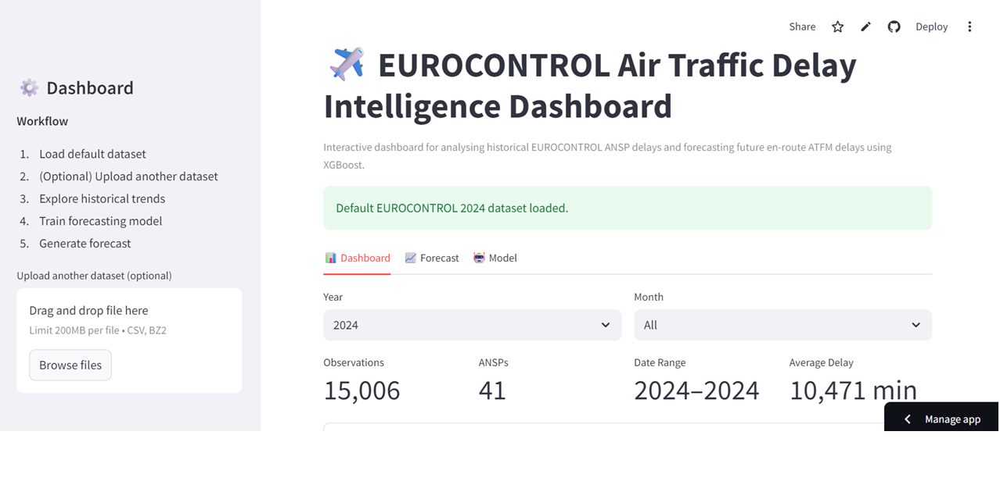
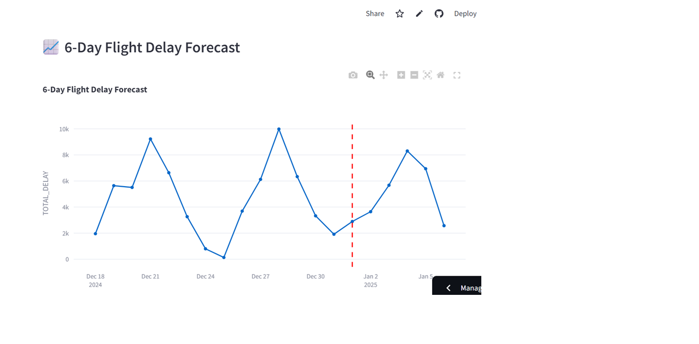
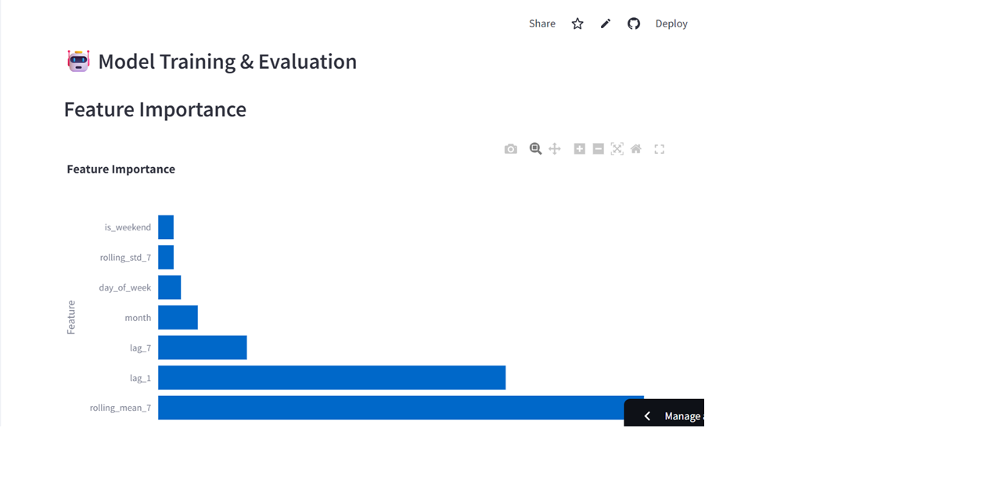

# ✈️ EUROCONTROL Air Traffic Delay Intelligence Dashboard

An interactive Streamlit dashboard for analysing historical EUROCONTROL Air Navigation Service Provider (ANSP) delay data and forecasting future en-route Air Traffic Flow Management (ATFM) delays using machine learning.

Live Demo: **[Click Here to Open](https://sha-md-eurocontrol-flight-delay-forecasting-app-lpetac.streamlit.app/)**
---

## 📑 Table of Contents

* [Project Overview](#-project-overview)
* [Business Objective](#-business-objective)
* [Why This Project Matters](#-why-this-project-matters)
* [Features](#-features)
* [Dashboard](#-dashboard)
* [Dataset](#-dataset)
* [Machine Learning Model](#-machine-learning-model)
* [Forecast Workflow](#-forecast-workflow)
* [Technologies Used](#-technologies-used)
* [Dashboard Preview](#-dashboard-preview)
* [Future Improvements](#-future-improvements)
* [Author](#-author)

---

## 📌 Project Overview

This project analyses historical EUROCONTROL Air Navigation Service Provider (ANSP) delay data to identify traffic congestion patterns and forecast future daily en-route Air Traffic Flow Management (ATFM) delays.

The application combines data preprocessing, interactive visualisation, feature engineering, and machine learning to provide operational insights for aviation stakeholders.

Potential users include:

* Air Navigation Service Providers (ANSPs)
* Airlines
* Airport operators
* Aviation researchers
* Air traffic management analysts

---

## 🎯 Business Objective

The objective of this project is to forecast daily en-route ATFM delays so aviation stakeholders can make informed operational decisions.

Accurate delay forecasting helps:

* Improve controller and resource planning
* Reduce operational disruptions
* Support airline schedule optimisation
* Improve airport congestion management
* Enable proactive capacity planning

---

## ✈️ Why This Project Matters

Unexpected flight delays increase operating costs, fuel consumption, crew overtime, passenger inconvenience, and environmental impact.

Forecasting future delay levels enables organisations to:

* Detect potential congestion early
* Improve operational planning
* Optimise resource allocation
* Support data-driven decision making
* Improve overall network efficiency

---

## 🚀 Features

* Interactive Streamlit dashboard
* Automatic preprocessing of EUROCONTROL datasets
* Default dataset included
* Optional upload of custom CSV/BZ2 datasets
* Historical daily and monthly delay analysis
* Adjustable forecast horizon (1–30 days)
* XGBoost-based delay forecasting
* Model evaluation using MAE, RMSE and Adjusted MAPE
* Feature importance visualisation
* Download forecast results as CSV
* Automated business insight generation

---

## 📊 Dashboard

The application is organised into three interactive tabs.

### 📊 Dashboard

* Dataset overview
* Year and month filters
* Daily delay trend
* Monthly delay trend
* KPI metrics
* Processed dataset preview

### 📈 Forecast

* Adjustable forecast horizon (1–30 days)
* Interactive forecast visualisation
* Forecast summary
* Business insight based on predicted delays
* Forecast export as CSV

### 🤖 Model

Displays:

* Mean Absolute Error (MAE)
* Root Mean Squared Error (RMSE)
* Adjusted Mean Absolute Percentage Error (MAPE)
* XGBoost feature importance

---

## 📂 Dataset
## Dataset

- **Source:** [EUROCONTROL Performance Review Unit (PRU)](https://ansperformance.eu/data/)  
- **Files Used:** `ert_dly_ansp_2020.csv.bz2` → `ert_dly_ansp_2024.csv.bz2`  
- **Time Range:** January 2020 – September 2025  
- **Volume:** ~50,000 records across multiple ANSPs  

### Default Dataset

```
ert_dly_ansp_2024.csv.bz2
```

Users may optionally upload their own compatible EUROCONTROL datasets for analysis.

---

## 🧠 Machine Learning Model

The forecasting engine is built using **XGBoost Regressor**.

### Feature Engineering

The following time-series features are generated automatically:

* Day of week
* Month
* Weekend indicator
* Previous day delay (Lag-1)
* Previous week delay (Lag-7)
* 7-day rolling mean
* 7-day rolling standard deviation

These engineered features help the model learn temporal patterns, seasonality, and recent traffic behaviour.

---

## 📈 Forecast Workflow

1. Load the default dataset or upload a custom dataset.
2. Clean and preprocess the data.
3. Aggregate delay records into daily totals.
4. Generate time-series features.
5. Train the XGBoost forecasting model.
6. Evaluate model performance.
7. Forecast future daily delays.
8. Visualise historical and predicted delays.
9. Export forecast results.

---

## 🛠 Technologies Used

* Python
* Streamlit
* Pandas
* NumPy
* Plotly
* XGBoost
* Scikit-learn
* Matplotlib

---

## 📷 Dashboard Preview

| Dashboard                 | Forecast                 |
| ------------------------- | ------------------------ |
|  |  |

### Model Evaluation



---

## 🚀 Future Improvements

* Multi-year forecasting
* Hyperparameter optimisation
* SHAP-based model explainability
* Weather data integration
* Flight volume prediction
* Model comparison with additional forecasting algorithms
* Real-time EUROCONTROL data integration
* Advanced dashboard analytics and KPI reporting

---

## 👤 Author

**Shabnam Begam Mahammad**  
[LinkedIn](https://www.linkedin.com/in/shabnam-b-mahammad) | [Email](mailto:md.shabnam21@gmail.com) 

“Transforming air traffic data into smarter skies through machine learning and data analytics.”
